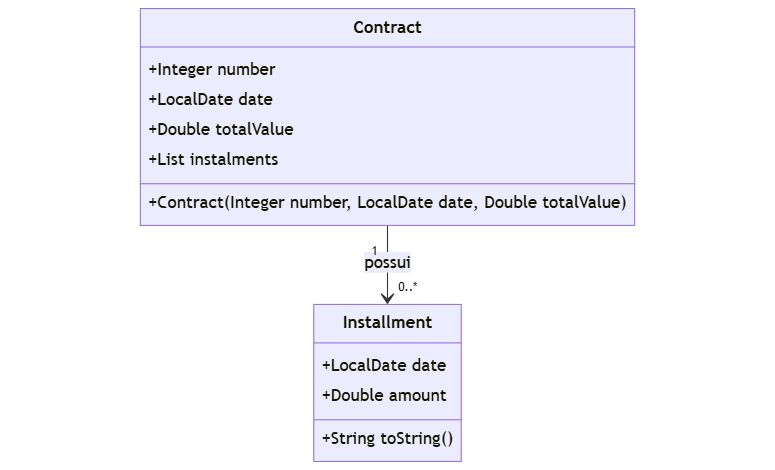
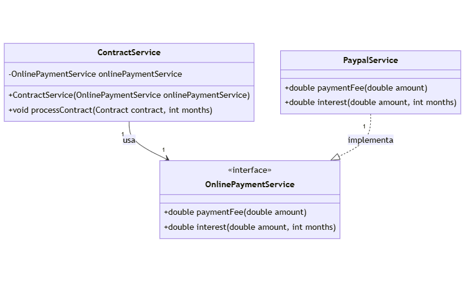

# Projeto Contratos 📝

## Descrição 📖
Este projeto é um sistema de gerenciamento de contratos que permite processar contratos e calcular parcelas usando diferentes métodos de pagamento online.

Abaixo está o diagrama de classes que ilustra a estrutura do projeto:

## Camada de Dominio 📊

- **Contract**: Representa um contrato com um número, data e valor total. Mantém uma lista de parcelas associadas ao contrato, que não pode ser modificada diretamente por meio de um setter. O contrato pode ser processado para adicionar parcelas com base em uma lógica específica.

- **Installment**: Representa uma parcela de um contrato, contendo uma data e um valor associado. Inclui um método `toString` que formata a data e o valor da parcela para exibição em um formato específico.

## Camada de Serviço 📈

- **ContractService**: Gerencia o processamento de contratos e interage com o serviço de pagamento online.
- **OnlinePaymentService**: Interface para serviços de pagamento online, como `PaypalService`.
- **PaypalService**: Implementa o serviço de pagamento online usando o PayPal.

## Resumo

Este projeto é um sistema simples de gerenciamento de contratos que permite processar contratos e calcular parcelas usando diferentes métodos de pagamento online. Ele oferece uma estrutura para lidar com contratos e suas parcelas, facilitando a gestão e o processamento de informações financeiras.

## Agradecimentos

Este projeto foi desenvolvido como parte do curso de Java da Devsuperior, ministrado pelo professor Nélio Alves. Agradecemos ao professor Nélio Alves e à Devsuperior pelo excelente material e suporte fornecido durante o curso.

## Contribuição

Se você deseja contribuir para o projeto, fique à vontade para enviar um pull request. Por favor, siga as diretrizes de contribuição e abra um issue se encontrar algum problema ou tiver sugestões de melhorias.

## Contato

Para mais informações ou dúvidas, você pode entrar em contato comigo através do e-mail: [victor_mathers@hotmail.com](mailto:victor_mathers@hotmail.com).

## Licença

Este projeto está licenciado sob a [Licença MIT](LICENSE). Veja o arquivo `LICENSE` para mais detalhes.
